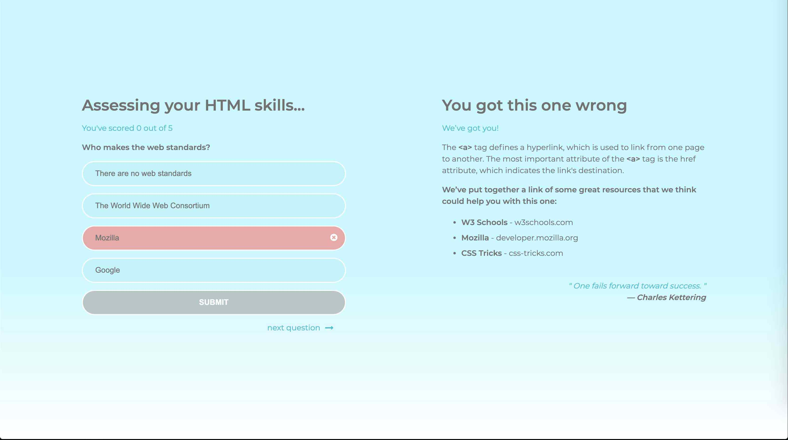
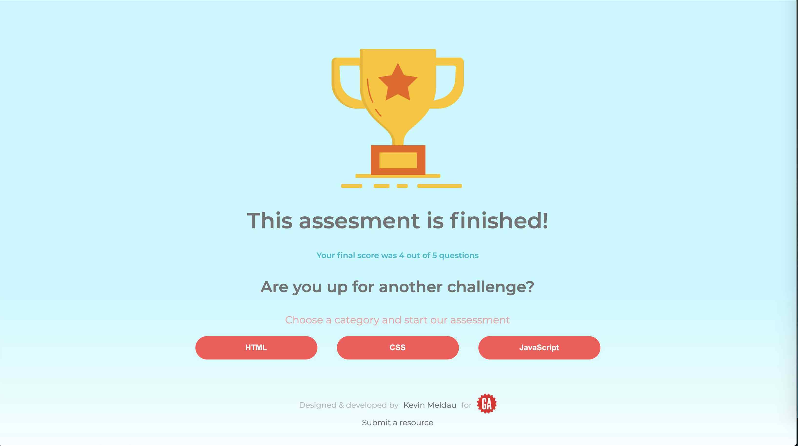
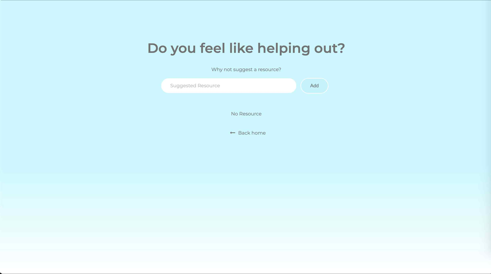

# Dev Quiz

Dev Quiz is project I created for my [JavaScript course](https://generalassemb.ly/education/javascript-development/atlanta) at [General Assembly](https://generalassemb.ly). There are three categories (HTML, CSS, and JavaScript) and each category has 50 multiple-choice questions. The user gets 1 score for each correct question answered.

When the user gets an answer wrong, they will be given the correct answer and suggested resources to readup on the question they got wrong. Along with the suggested resources they will also get a random quote to make them feel better about being such a failure. :laughing:

The random quotes are generated using [Type Fit](https://type.fit/api/quotes).

**Link to live site**: [Dev Quiz - Kevin Meldau](https://kevinmeldau.github.io/dev_quiz/)

**Live Demo**: [Dev Quiz](https://www.loom.com/share/c22235a556954fb898242cc3f48e87a7)

## Example array structure

```
// Example question
  {
    question: "What color is the White House?",
    answers: [
      { text: "Blue", correct: false },
      { text: "White", correct: true },
      { text: "Red", correct: false },
      { text: "Yellow", correct: false },
    ],
    incorrect_explanation:
      "The White House is white because everyone that works there is as pure as snow.",
    resources: [
      {
        text: "Link to suggested resource",
      },
      { text: "Link to suggested resource", },
    ],
  },
```

_Screenshot of index page_


_Screenshot of HTML quiz_


_Screenshot of HTML quiz - user gets answer incorrect_



_Screenshot of complete page - once the user has completed the quiz_



_Screenshot of suggested resource page_

